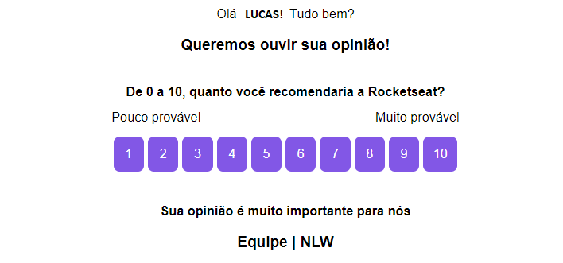

<h1 align="center">
    Rest API for NPS (Net Promoter Score)
</h1>

  <a href="#-tecnologias">Tecnologias</a>&nbsp;&nbsp;&nbsp;|&nbsp;&nbsp;&nbsp;
  <a href="#-projeto">Projeto</a>&nbsp;&nbsp;&nbsp;|&nbsp;&nbsp;&nbsp;
  <a href="#-licença">Licença</a>

  
  
  
  

 

  

## 🚀 Tecnologias

Esse projeto foi desenvolvido com as seguintes tecnologias:

- [TypeScript](https://www.typescriptlang.org/)
- [Ethereal-Email](https://ethereal.email/)
- [TypeORM](https://typeorm.io/#/)
- [Express](https://expressjs.com/pt-br/)
- [Jest](https://jestjs.io/)
- [SQL Editor Beekeeper Studio](https://www.beekeeperstudio.io/)

## 💻 Projeto

O NPS(Net Promoter Score) é uma aplicação que consiste em calcular o NPS da empresa. Nele fazemos o cadastro de usuários, cadastro de pesquisas, envio de e-mail para os usuários responderem as pesquisas de satisfação e com isso podemos realizar o cálculo do NPS.

Este é um projeto desenvolvido durante a Next Level Week #04, realizada pela [@Rocketseat](https://github.com/Rocketseat) durante os dias 22 a 28 de Fevereiro de 2021. 💜

## 📝 Licença

Esse projeto está sob a licença MIT. Veja o arquivo [LICENSE](LICENSE.md) para mais detalhes.

---

#### Desenvolvido por Lucas Barbosa 💜